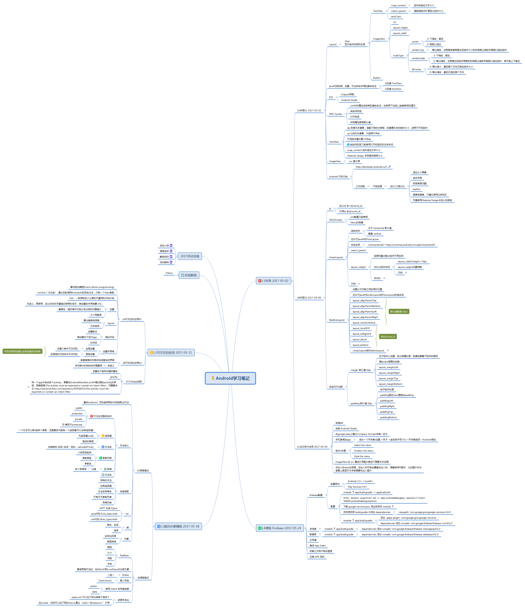

# Android Study
学习 Android 的练习代码及笔记。

keytool -exportcert -list -v -alias androiddebugkey -keystore C:\Users\XXXX\.android\debug.keystore

pwd: android

1.Activity Basic
2.Activity Bottom Navigation
+Activity Empty
+Activity Fullscreen
+Activity Login
+Activity Master Detail
+Activity Navigation Drawer
+Activity Scrolling
+Activity Settings
+Activity Tabbed

